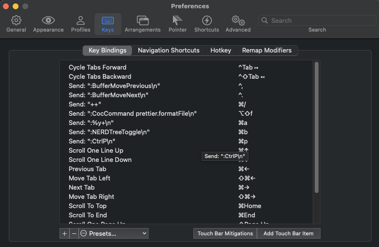

# Neovim setup 

## Setup
```
brew install iterm2
brew install neovim
cd .config/
git clone git@github.com:taZgg/nvim-config.git
mv nvim-config nvim

sh -c 'curl -fLo "${XDG_DATA_HOME:-$HOME/.local/share}"/nvim/site/autoload/plug.vim --create-dirs \
       https://raw.githubusercontent.com/junegunn/vim-plug/master/plug.vim'


nvim init.vim

:PlugInstall
:PlugClean
:CocInstall coc-snippets

```

## Iterm2 key map
<div align="center"></div>

## document
 - [https://github.com/junegunn/vim-plug](https://github.com/junegunn/vim-plug)
 - [https://github.com/neoclide/coc-snippets](https://github.com/neoclide/coc-snippets)
 - [https://github.com/taZgg/vim-snippets](https://github.com/taZgg/vim-snippets)
